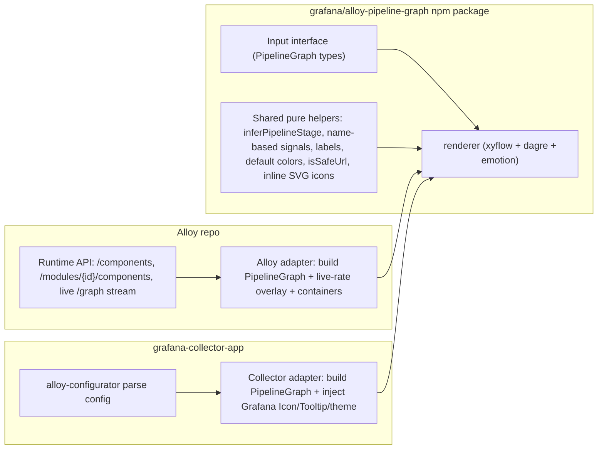

# Shared pipeline graph package

## Goal

Decouple the visualization (renderer) from the data source. One renderer, two adapters:
- Alloy shapes its runtime API into the input interface (no config parsing).
- The collector app shapes parsed config (`@grafana-cloud/alloy-configurator`) into the same interface.

The renderer becomes a new public package `@grafana/alloy-pipeline-graph` (new repo `grafana/alloy-pipeline-graph`), owned by the fleet/collector team, consumed via npm by both. It has no hard dependency on `@grafana/ui` / `@grafana/data` and uses `@emotion/css` for styling, with optional injection of Grafana primitives for in-Grafana visual consistency.

## Architecture



## The input interface (the contract)

Consumer-specific data is optional; the renderer shows it only when present. Extends the POC types already in [internal/web/ui/src/features/pipeline/types.ts](internal/web/ui/src/features/pipeline/types.ts).

```ts
export enum SignalKind { Metrics='metrics', Logs='logs', Traces='traces', Profiles='profiles', Other='other' }
export enum PipelineStage { Collect='collect', Process='process', Send='send', Other='other' }
export type PipelineNodeKind = 'component' | 'customComponentContainer';

export interface PipelineNode {
  id: string;
  componentName: string;
  label: string | null;
  stage: PipelineStage;
  signals: SignalKind[];
  kind?: PipelineNodeKind;          // container support
  parentId?: string;                // inner node -> container id
  description?: string;             // collector app (schema); optional for Alloy
  docsUrl?: string;                 // sanitized before render (isSafeUrl)
  health?: 'healthy' | 'unhealthy' | 'unknown' | 'exited'; // Alloy only -> status dot
  meta?: Record<string, string | number>; // consumer passthrough for onNodeClick
}

export interface PipelineEdge {
  id: string;
  source: string;
  target: string;
  signals: SignalKind[];
  // Optional quantitative flow rate (Alloy live stream). Present -> show value;
  // absent -> show signal label only (current static behaviour).
  metric?: { value: number; unit?: string };
}

export interface PipelineGraph { nodes: PipelineNode[]; edges: PipelineEdge[]; }
```

Renderer props (self-sufficient; Grafana primitives optional):

```ts
interface PipelineGraphProps {
  graph: PipelineGraph;
  onNodeClick?: (node: PipelineNode) => void;  // consumer decides navigation
  compact?: boolean;
  animateEdges?: boolean;                       // collector app: !prefersReducedMotion
  theme?: 'light' | 'dark' | PipelineGraphTheme; // default light; collector app maps GrafanaTheme2
  ui?: { Icon?: IconComponent; Tooltip?: TooltipComponent }; // optional overrides; built-in fallbacks
}
```

## Package internals (ported + de-Grafana-ified)

Port from [grafana-collector-app NativePipelineGraph.tsx](../grafana-collector-app/src/feature/remote-configuration/components/drawer/visualization/NativePipelineGraph.tsx) and its siblings, replacing Grafana-specific bits:
- `useStyles2`/`useTheme2` -> `@emotion/css` + package theme tokens (`PipelineGraphTheme`, light/dark presets).
- `@grafana/ui` `Icon` -> built-in inline SVG icon set (import/process/cloud-upload/question-circle/cube/angle-up/angle-down/info-circle) so both consumers look identical with zero icon-lib dep; overridable via `ui.Icon`.
- `@grafana/ui` `Tooltip` -> minimal emotion tooltip; overridable via `ui.Tooltip`.
- `@grafana/data` `GrafanaTheme2`/`IconName` -> package types + tokens.
- `FaroErrorBoundary`/`ErrorWithStack` -> small internal error boundary.
- `usePrefersReducedMotion` -> internal matchMedia hook (or `animateEdges` prop).
- `isSafeUrl` -> ship in package (reject `javascript:`/`data:`; required by frontend security rules before rendering `docsUrl`).
- Keep container expand/collapse, nested dagre inner layout, parallel/sibling edges, edge metric+signal labels, legend, controls verbatim in behaviour.

Also ship the genuinely shared, consumer-agnostic helpers: `inferPipelineStage`, name-based `inferSignalKinds`, `labels`, default `colors`. Schema-based inference ([inferSignalKinds.ts](../grafana-collector-app/src/feature/remote-configuration/components/drawer/visualization/inferSignalKinds.ts)) stays in the collector app (needs the configurator schema).

Package setup: library build (ESM + d.ts) via tsup/vite; `peerDependencies`: react, react-dom; `dependencies`: @xyflow/react, @dagrejs/dagre, @emotion/css; no `@grafana/*`. Port the existing vitest tests from the collector app. Publish to public npm via GitHub Actions + changesets.

## Alloy adapter (this repo)

Replace the POC renderer files under [internal/web/ui/src/features/pipeline/](internal/web/ui/src/features/pipeline/) with consumption of the package; keep only Alloy-specific adapter + page wiring.

- Add deps `@grafana/alloy-pipeline-graph` and `@emotion/css`.
- `buildPipelineGraph(components)` keeps mapping `ComponentInfo[]` -> interface (already in the POC), but extended for containers and edges without `metric`.
- Containers: a component with non-empty `createdModuleIDs` is a custom-component container. The list response already includes it ([component_provider.go:213](internal/component/component_provider.go)); add `createdModuleIDs?: string[]` to the `ComponentInfo` TS type in [internal/web/ui/src/features/component/types.ts](internal/web/ui/src/features/component/types.ts) and lazily fetch `/api/v0/web/modules/{moduleID}/components` (pattern already used in [ComponentDetailPage.tsx](internal/web/ui/src/pages/ComponentDetailPage.tsx)) to emit inner nodes with namespaced ids + `kind: 'customComponentContainer'` + `parentId`. No backend change.
- Live flow rate: re-introduce the streaming hook ([internal/web/ui/src/hooks/graph.tsx](internal/web/ui/src/hooks/graph.tsx)) and overlay the stream's `DebugData` ([debugDataType.ts](internal/web/ui/src/features/graph/debugDataType.ts): componentID, targetComponentIDs, rate, type) onto edges' optional `metric`, reusing the matching logic from the old [ComponentGraph.tsx](internal/web/ui/src/features/graph/ComponentGraph.tsx). Restore the Window slider + legend controls on the page.
- Wire in [Graph.tsx](internal/web/ui/src/pages/Graph.tsx); `onNodeClick` opens the component detail page (using `node.meta` moduleID/localID).
- Remove the now-unused old `features/graph/` files once parity is confirmed.

## Collector-app adapter (separate repo, documented for the design doc)

- Add `@grafana/alloy-pipeline-graph`; delete the local renderer files, keep its config-parsing `buildPipelineGraph` + schema inference, mapping into the interface.
- Inject Grafana `Icon`/`Tooltip` via `ui` prop and map `GrafanaTheme2` -> `PipelineGraphTheme` for visual consistency; edges have no `metric` (static view) so they render signal labels only.

## Sequencing note

Alloy OSS CI runs `npm ci`, so the package must be published before Alloy pins a version. Order: build+publish package v0.x -> Alloy consumes -> migrate collector app.