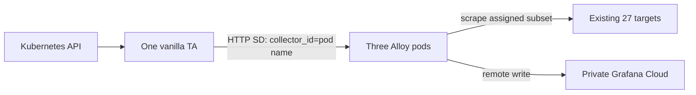

# Hackathon 18: size-aware scrape target allocation

Working plan for the demo by Friday 2 October 2026. Increase fidelity as we make
decisions together. Milestones 1 and 2 are implemented; the custom allocation algorithm remains open.

All Alloy configuration, kind setup, and demo assets live in this repository on
`thampiotr/hackathon-target-allocator`. Target Allocator development lives in
`~/workspace/opentelemetry-operator`, with
[thampiotr/opentelemetry-operator](https://github.com/thampiotr/opentelemetry-operator)
as the fork and the OpenTelemetry repository as `upstream`.

## 1. Build a skewed scrape example in a local kind cluster

Demonstrate uneven scrape load using standard Alloy clustering, with every Alloy
instance doing discovery and relabeling. Send metrics to Piotr's private Grafana
Cloud stack so the baseline is visible and reusable for later comparisons.

### Reuse the existing Kubernetes setup

- Extend [example/kind](example/kind/README.md) for the persistent demo. Put its
  configuration and workload manifests under `example/kind/config/target-allocation/`
  and add demo tasks to the existing Taskfile as we implement them.
- Reuse its kind lifecycle, explicit kubeconfig, and local Alloy Helm chart.
  Keep demo workloads running until an explicit teardown so Cloud observations
  and the presentation can continue after setup finishes.
- Reuse [Kubernetes integration-test](integration-tests/k8s/README.md) fixtures and
  conventions where useful. Its runner already builds and loads images, and its
  Alloy dependency installs the same local chart with a config file and values.
- The integration runner's `--reuse-cluster` keeps the cluster, but the test harness
  still removes test workloads. It is suitable for automated validation; the
  persistent demo should use the existing example tasks.
- Extend the existing
  [prom-gen fixture](integration-tests/docker/configs/prom-gen/main.go) with an
  opt-in `--series` setting. Preserve its defaults for existing tests and reuse
  `make prom-gen-image`. The synthetic mode emits a fixed number of stable gauge
  series per target.

### Proposed starting setup

- Use one single-node kind cluster and a dedicated demo namespace. Keep other
  kind clusters stopped to conserve laptop memory. Three Alloy pods share the node.
- Use focused fixture tests and configuration checks locally; avoid full-repo
  lint and test runs on this laptop.
- Deploy three Alloy replicas using the Alloy Helm chart and a StatefulSet for
  stable scraper names. Pin the chart and image versions when implementing.
- Enable both Helm's `alloy.clustering.enabled` and the `clustering` block in
  `prometheus.scrape`. Use identical discovery, relabeling, and scrape configuration
  on all replicas, with the chart providing peer discovery.
- Use the pipeline `discovery.kubernetes` → `discovery.relabel` →
  `prometheus.scrape` → `prometheus.remote_write`. All replicas discover the full
  demo target set; Alloy's consistent hashing decides which targets each scrapes.
- Use a released Alloy image for the baseline so existing local source changes
  do not affect the experiment.

This follows the repository's [clustering model](docs/sources/get-started/clustering.md)
and [Helm configuration](operations/helm/charts/alloy/values.yaml).

### Generate controllable skew

- Use the existing prom-gen fixture with configurable series counts. Keep series
  identities stable throughout the measurement window.
- Use several large targets among many small targets. A provisional workload is
  3 targets at 800 series each and 24 at 10 series each, all scraped every 30 seconds.
  The workload stays below the agreed roughly 5,000-series budget. Change the workload and
  scrape interval in [settings.json](example/kind/config/target-allocation/settings.json).
- That starting profile is 2,640 workload series and 88 samples/second, excluding
  monitoring overhead. Measure actual exposed sample counts before fixing the profile.
- Keep the workload, target identities, scrape interval, and resource settings
  fixed across comparisons. Record the actual ownership distribution; do not assume
  consistent hashing will produce the same skew after recreating pods or the cluster.
- Establish observable imbalance before freezing the workload. Include multiple
  large targets so a better allocation could help: no allocator can split one
  indivisible target across scrapers.

### Send metrics to Grafana Cloud and attribute the work

- Configure the private stack's Prometheus remote-write URL, metrics tenant ID,
  and write token through a Kubernetes Secret. Keep credentials out of tracked files.
- Label the experiment and run so its metrics can be isolated in Cloud.
- Add a scraper identity label after ownership selection, for example through
  remote-write external labels. Replica-specific labels must not change the target
  labels presented to the clustering hash.
- Preserve a stable target identity as well as the scraper identity. A target move
  will create a different Cloud series when the scraper label changes; account for
  this in later comparisons.
- Collect Alloy's own metrics from every replica using a separate, unclustered
  self-scrape. Record process CPU and memory, scrape health, and remote-write health.

### Baseline evidence

- Show target count and the sum of `scrape_samples_scraped` per Alloy replica.
  Treat samples per scrape as the initial size proxy, not an exact memory estimate.
- Calculate load imbalance as maximum per-replica load divided by mean load,
  including replicas with zero assigned targets.
- Show CPU and memory alongside load; allow a warm-up period before recording a
  fixed measurement window. Confirm successful scrapes and remote-write delivery.
- Verify all three replicas see the full discovered target set, while each target
  has one scraper in steady state. Check ownership through Alloy's debug views.
- Record discovery duplication separately from total process resource usage.
  Total Alloy CPU or memory alone cannot establish how much discovery costs;
  component metrics or profiles may be needed when quantifying savings later.

### Deliverables and completion criteria

- [x] Reproducible kind setup, target manifests, Helm values, and Alloy configuration.
- [x] Documented commands to start, stop, and repeat the baseline.
- [x] Metrics arriving in the private Grafana Cloud stack.
- [x] Saved baseline queries or a minimal dashboard showing skew and scraper health.
- [x] Recorded versions, workload, ownership, and measurement window for comparison.

The private Cloud stack is `https://thampiotr.grafana.net`, with gcx context
`thampiotr`. The ignored `example/kind/.env.credentials` holds its remote-write
settings and stack-scoped metrics-write token (expires 6 October 2026).

The [baseline runbook](example/kind/config/target-allocation/README.md) contains
setup, resizing, measurement, and teardown commands. Local baseline measurements
confirm the original 4,800-series run and the revised 2,640-series run. The revised
profile selects one heavy peer and two light peers (2,430 / 120 / 90 series).
The starting profile shows clear skew. Local resource limits remain optional tuning.

## 2. Add vanilla Target Allocator

### Scope and architecture

Run one unmodified upstream TA Deployment in the existing single-node kind cluster
and `target-allocation` namespace. TA performs Kubernetes target discovery and
collector membership discovery. The three Alloy pods fetch their assigned subsets
with `discovery.http`, then scrape and remote-write to the existing Cloud stack.
No Operator, CRDs, TA fork changes, embedding, or new Alloy component are needed.
Keep milestones 3 and 4 unchanged.

Use the published image
`ghcr.io/open-telemetry/opentelemetry-operator/target-allocator:0.160.0`.
Its manifest was verified to include Linux arm64 and amd64 without pulling it.
Pin the resolved platform or index digest during implementation; the arm64 manifest
is `sha256:661fffdd627392d4b1679d4252c9e91779e6228b23d2fd7805e61198638b4d65`.
Source review below is against upstream release `v0.160.0`, not an assumption based
on the checkout's main. No local TA build is needed.



### Allocator configuration and Kubernetes resources

- Add Deployment (one replica), ClusterIP Service on port 8080, ConfigMap,
  ServiceAccount, and namespace-scoped Role/RoleBinding to the existing renderer.
  Mount TA configuration at `/conf/targetallocator.yaml`. Use `/livez` and `/readyz`
  probes, checking semantics on the pinned image. Keep the Service internal.
- Set `collector_namespace: target-allocation`. Set `collector_selector.matchLabels`
  to the Alloy release's pod labels (`app.kubernetes.io/name: alloy` and
  `app.kubernetes.io/instance: alloy-target-allocation`), verified from live pods.
  TA uses the pod name as collector ID. Keep `POD_NAME` from the downward API.
- Use `allocation_strategy: consistent-hashing` initially, selectable through
  settings. Add a sequential `least-weighted` comparison after the first mode works.
  Both remain vanilla algorithms; neither estimates target series counts.
- Set `filter_strategy: relabel-config`, `prometheus_cr.enabled: false`, and
  `listen_addr: ':8080'`. Retain the default collector readiness grace period
  initially. Do not make Alloy readiness depend on receiving a nonempty assignment.
- Under `config.scrape_configs`, define one job, `target-allocation`, with pod-role
  Kubernetes SD restricted to the demo namespace and the existing target label
  selector. Use the existing ready-pod/metrics-port keep rule. Preserve the target
  naming and size labels. Set scrape interval and timeout consistently with Alloy.
- Start with pod `get/list/watch` permissions in this namespace for TA's two pod
  discovery paths. Do not request node metadata or enable other discovery roles.
  Validate RBAC at runtime and add permissions only if the pinned code requires them.
  TA needs neither the Cloud write token nor access to Kubernetes Secrets.

### Alloy pipeline and the relabeling boundary

Replace Kubernetes discovery in TA mode with:

```alloy
discovery.http "demo" {
  url = "http://target-allocator:8080/jobs/target-allocation/targets?collector_id=" + sys.env("POD_NAME")
  refresh_interval = "10s"
}

discovery.relabel "demo" {
  targets = discovery.http.demo.targets
  // Preserve the existing instance and size_class mapping rules.
}

prometheus.scrape "demo" {
  targets = discovery.relabel.demo.output
  job_name = "target-allocation"
  scrape_interval = sys.env("DEMO_SCRAPE_INTERVAL")
  forward_to = [prometheus.remote_write.cloud.receiver]
}
```

This is a wiring sketch; validate the completed config with the pinned Alloy image.
Disable both Helm `alloy.clustering.enabled` and scrape clustering in TA mode, and
remove `--cluster.node-name`. TA is the sole owner of allocation; a second hash
step would discard some already assigned targets. Self-scrapes remain unclustered.

Important source finding: vanilla TA applies relabel rules for filtering and
allocation hashing, but its HTTP response carries the original discovery labels.
The response is not a fully relabeled target list. Keep the small label-mapping
step in Alloy, applied only to its assigned subset, to retain `instance` and
`size_class`. TA does full-set Kubernetes discovery and filtering; Alloy no longer
watches Kubernetes. This milestone does not claim to centralize all relabel work.

`discovery.http` consumes target lists, not TA's `/scrape_configs` API. Keep the
single job's scrape settings explicit in Alloy; dynamically importing arbitrary
jobs, auth, or metric relabel settings is outside this milestone.

In TA mode, disable the Alloy chart's RBAC resources and service-account token
automount. This gives a concrete check that scrapers no longer need Kubernetes API
access. Retain their existing Cloud Secret and remote-write labels.

### Switching modes without changing the workload

- Add `discovery_mode: alloy|ta`, `ta_image`, `ta_strategy`, and
  `http_refresh_interval_seconds` to settings. Default remains the existing Alloy
  baseline until TA has passed validation. Keep HTTP polling independent of the
  30-second scrape interval. Make resource requests configurable and modest.
- Add a mode-switch task which updates only TA and Alloy resources. Do not recreate
  target pods, rebuild prom-gen, or create a second cluster when changing mode.
  Preserve the current target IPs and record them before comparison.
- Reuse the existing Alloy release, namespace, settings and credentials. Use
  distinct `run_id` values (`baseline-onehot`, `ta-consistent`, `ta-least-weighted`).
  Keep experiment, job, instance and size_class labels unchanged.
- Switching mode rolls Alloy, so a brief overlap/gap is expected. Record the switch
  time; exclude startup and at least the backend lookback interval after assignments
  stabilize. Do not describe cutover as lossless. Verify steady state separately.
- Keep a rollback command that restores baseline Alloy configuration and its RBAC,
  then removes or scales TA down. Never leave two active discovery modes or a second
  kind cluster running. Preserve target pods during rollback as well.
- Do not reshape the workload to force vanilla TA to reproduce Alloy's deliberately
  selected one-heavy-peer placement. Different allocation hashes can yield a different
  distribution; compare the same target set and report the result honestly.

### Observability and focused validation

1. Render manifests, lint the Helm values, validate the Alloy configuration, and
   check the TA image/config startup. Only focused Python/config tests and live
   checks; no full repo test/lint run or local TA compilation.
2. Confirm TA sees exactly three collectors, one scrape job, and 27 eligible
   targets. Query `/jobs/target-allocation/targets?collector_id=<pod>` for every
   peer. Assert HTTP 200/JSON, disjoint subsets, and a union of exactly 27 targets.
   Empty assignments are valid; the wrong collector ID can also return an empty
   list, so do not use successful HTTP status alone as proof of correctness.
3. Check Alloy HTTP discovery output equals its TA assignment and that the final
   labels match the baseline. Check all 27 targets healthy and exactly one current
   owner per target in Cloud; workload series must total 2,640 after warm-up.
4. Confirm no Alloy `discovery.kubernetes` component or Kubernetes watch permissions
   remain in TA mode. Record this structural removal of duplicate discovery; do not
   infer discovery CPU savings from total process RSS alone.
5. Preserve peer self-monitoring and add HTTP SD failure/refresh metrics to the
   self-scrape allowlist. Scrape TA's `/metrics` once, using one designated Alloy pod
   and the TA Service address, without adding it to workload totals. Verify metric
   names in the pinned image before configuring the keep filter. Include TA process
   CPU/RSS in total-cost comparisons; keep monitoring ingest within the existing budget.
6. Record target counts, series loads, max/mean (including zero-load peers), CPU,
   RSS, versions and run window. Run `consistent-hashing` first, then optionally
   `least-weighted` on the same targets. Success here is centralized discovery and
   correct scraping, not an assumed series-balance improvement.
7. Briefly restart TA and verify existing scrapes plus HTTP refresh failures and
   recovery. Verify behavior of a successful empty list separately from an HTTP
   error; retained discovery targets must not be mistaken for fresh assignments.
   Exercise one collector replacement and restore three peers, recording moves and
   time to convergence. TA is a single point of failure in this demo, with no HA claim.

### Completion criteria

- [x] Vanilla TA runs standalone in the existing cluster with scoped RBAC.
- [x] Alloys use HTTP discovery exclusively for the demo job, with no double sharding.
- [x] All 27 targets have one healthy scraper and 2,640 workload series reach Cloud.
- [x] Baseline/TA switching and rollback preserve workload pods.
- [x] TA overhead and HTTP discovery health are observable; a comparison is recorded.
- [x] Runbook covers start, switch, rollback, warm-up and the vanilla relabel limitation.

### Source checks and implementation readiness

Verified against upstream release `v0.160.0`:
- [TA configuration and HTTP API](https://github.com/open-telemetry/opentelemetry-operator/blob/v0.160.0/docs/target-allocator/README.md).
- [Collector pod selection and IDs](https://github.com/open-telemetry/opentelemetry-operator/blob/v0.160.0/cmd/otel-allocator/internal/collector/collector.go).
- [Relabel filtering and original label retention](https://github.com/open-telemetry/opentelemetry-operator/blob/v0.160.0/cmd/otel-allocator/internal/target/discovery.go).
- [HTTP target serialization and empty assignments](https://github.com/open-telemetry/opentelemetry-operator/blob/v0.160.0/cmd/otel-allocator/internal/server/server.go).
- [Alloy HTTP discovery](docs/sources/reference/components/discovery/discovery.http.md)
  and [Helm settings](operations/helm/charts/alloy/values.yaml).

Implemented and checked on 29 September 2026. Commands and settings are in the
[runbook](example/kind/config/target-allocation/README.md). TA uses upstream 0.160.0
at multi-platform digest `sha256:df98ddd322a68fa354f1008523bb4e32ad2d250fba7883214c479bb976ddc3ea`.

Observed on the unchanged 27-target workload:

| Mode | Series by peer (0 / 1 / 2) | Max / mean |
| --- | --- | ---: |
| Alloy selected baseline | 120 / 90 / 2430 | 2.7614 |
| TA consistent-hashing | 880 / 100 / 1660 | 1.8864 |
| TA least-weighted, after rolling switch | 1720 / 0 / 920 | 1.9545 |

The least-weighted run had three registered collectors but left one idle after
rolling membership changes. This is the observed vanilla behavior, not a claim
that target counts always converge to an even split. Both TA modes passed the
27-target disjoint-union and scrape-health checks. The short least-weighted sample
uses fresh samples (45-second age cutoff), not a long steady-state benchmark.

The TA-consistent Cloud snapshot at 14:02 UTC is saved locally in ignored
`example/kind/build/target-allocation/ta-consistent.json`. TA RSS was about 88 MiB;
Alloy peers were about 239 / 233 / 229 MiB. These snapshots include restart recovery
and establish telemetry availability, not controlled CPU/memory savings.

Recovery checks: during a roughly 40-second TA outage, all peers retained their
last target subsets and each reported four failed HTTP refreshes. TA restart and
one Alloy pod replacement recovered to correct assignments. Unknown collector IDs
returned `[]`. Rollback restored Alloy pod-watch permissions and the original
assignment, then removed TA. Every target UID and IP remained unchanged.

Validation uses the pinned Alloy binary, Helm lint, focused Python tests, and the
live `target-allocation:verify` task. No full-repository lint/test run or local TA
build was performed. The existing cluster remains the only active kind cluster.

## 3. Customise Target Allocator to better assign targets

Work together to invent the allocation algorithm.

Preparation: `task target-allocation:local` builds the unchanged local operator
checkout's TA, packages it with the upstream Dockerfile, loads it into the existing
kind cluster, and switches Alloy to that image. Builds use limited concurrency and
content-derived image tags; source revision and image ID are recorded in ignored
`build/target-allocation/local-build.json`. See the runbook for rebuilding and
returning to the published TA. No custom allocation algorithm has been added.

Verified the clean operator revision `e9e4c53cb656f932d42a31a56d7860bf0987b7e9`
with a local ARM64 build and a cached rebuild. Runtime image provenance matches;
all 27 target pod identities are unchanged and Cloud run `ta-local` receives
880 / 100 / 1,660 series across the peers.

## 4. Make a demo

Make the demo. Stretch goal: try it in a dev cluster to demonstrate real savings.
