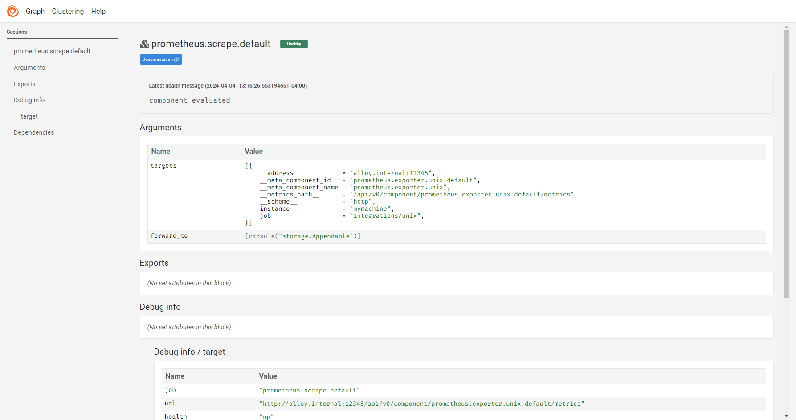

<p align="center">
    
    
</p>

<p align="center">
  <a href="https://github.com/grafana/alloy/releases"></a>
  <a href="https://grafana.com/docs/alloy/latest"></a>
</p>

Grafana Alloy is an open source OpenTelemetry Collector distribution with
built-in Prometheus pipelines and support for metrics, logs, traces, and
profiles.

<p>

</p>

## What can Alloy do?

* **Programmable pipelines**: Use a rich [expression-based syntax][syntax] for
  configuring powerful observability pipelines.

* **OpenTelemetry Collector Distribution**: Alloy is a [distribution][] of
  OpenTelemetry Collector and supports dozens of its components, alongside new
  components that make use of Alloy's programmable pipelines.

* **Big tent**: Alloy embraces Grafana's "big tent" philosophy, where Alloy
  can be used with other vendors or open source databases. It has components
  to perfectly integrate with multiple telemetry ecosystems:

  * [OpenTelemetry Collector][]
  * [Prometheus][]
  * [Grafana Loki][]
  * [Grafana Pyroscope][]

* **Kubernetes-native**: Use components to interact with native and custom
  Kubernetes resources; no need to learn how to use a separate Kubernetes
  operator.

* **Shareable pipelines**: Use [modules][] to share your pipelines with the
  world.

* **Automatic workload distribution**: Configure Alloy instances to form a
  [cluster][] for automatic workload distribution.

* **Centralized configuration support**: Alloy supports retrieving its
  configuration from a [server][remotecfg] for centralized configuration
  management.

* **Debugging utilities**: Use the [built-in UI][ui] for visualizing and
  debugging pipelines.

[syntax]: https://grafana.com/docs/alloy/latest/concepts/configuration-syntax/
[distribution]: https://opentelemetry.io/docs/collector/distributions/
[OpenTelemetry Collector]: https://opentelemetry.io
[Prometheus]: https://prometheus.io
[Grafana Loki]: https://github.com/grafana/loki
[Grafana Pyroscope]: https://github.com/grafana/pyroscope
[modules]: https://grafana.com/docs/alloy/latest/concepts/modules/
[cluster]: https://grafana.com/docs/alloy/latest/concepts/clustering/
[remotecfg]: https://grafana.com/docs/alloy/latest/reference/config-blocks/remotecfg/
[ui]: https://grafana.com/docs/alloy/latest/tasks/debug/

## Example

```alloy
otelcol.receiver.otlp "example" {
  grpc {
    endpoint = "127.0.0.1:4317"
  }

  output {
    metrics = [otelcol.processor.batch.example.input]
    logs    = [otelcol.processor.batch.example.input]
    traces  = [otelcol.processor.batch.example.input]
  }
}

otelcol.processor.batch "example" {
  output {
    metrics = [otelcol.exporter.otlp.default.input]
    logs    = [otelcol.exporter.otlp.default.input]
    traces  = [otelcol.exporter.otlp.default.input]
  }
}

otelcol.exporter.otlp "default" {
  client {
    endpoint = "my-otlp-grpc-server:4317"
  }
}
```

## Getting started

Check out our [documentation][] to see:

* [Installation instructions][install] for Alloy
* Steps for [Getting started][get-started] with Alloy
* The list of Alloy [components][]

[documentation]: https://grafana.com/docs/alloy/latest
[install]: https://grafana.com/docs/alloy/latest/get-started/install/
[get-started]: https://grafana.com/docs/alloy/latest/get-started/
[components]: https://grafana.com/docs/alloy/latest/reference/components/

## Release cadence

A new minor release is planned every six weeks.

The release cadence is best-effort: if necessary, releases may be performed
outside of this cadence, or a scheduled release date can be moved forwards or
backwards.

Minor releases published on cadence include updating dependencies for upstream
OpenTelemetry Collector code if new versions are available. Minor releases
published outside of the release cadence may not include these dependency
updates.

Patch and security releases may be published at any time.

## Community

To engage with the Alloy community:

* Chat with us on our community Slack channel. To invite yourself to the
  Grafana Slack, visit <https://slack.grafana.com/> and join the `#alloy`
  channel.

* Ask questions on the [Grafana community site][community].

* [File an issue][issue] for bugs, issues, and feature suggestions.

* Attend the monthly [community call][community-call].

[community]: https://community.grafana.com/c/grafana-alloy
[issue]: https://github.com/grafana/alloy/issues/new
[community-call]: https://docs.google.com/document/d/1TqaZD1JPfNadZ4V81OCBPCG_TksDYGlNlGdMnTWUSpo

## Contributing

Refer to our [contributors guide][] to learn how to contribute.

Thanks to all the people who have already contributed!

<a href="https://github.com/grafana/alloy/graphs/contributors">
  
</a>

[contributors guide]: https://github.com/grafana/alloy/blob/main/docs/developer/contributing.md
