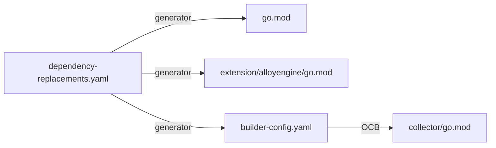
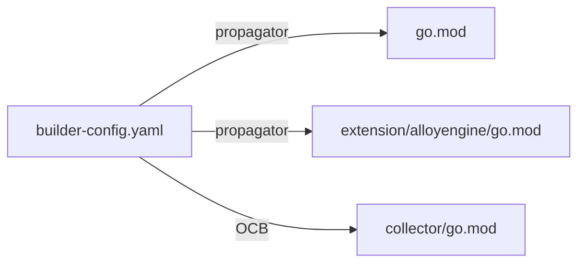
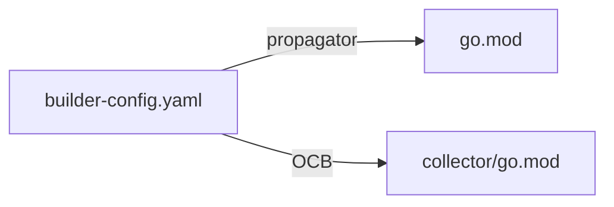

# Mini design: Revisiting Module Structure for Alloy Engine Extension

#### Authors: [Kyle Eckhart](https://github.com/kgeckhart), [Joe Harvey](https://github.com/jharvey10), Claude (AI assistant)

* Proposal issue: https://github.com/grafana/alloy/issues/6173

# Context

[Design doc 4719](./4719-otel-engine-dependency-management.md) introduced the three-module structure (Alloy, `extension/alloyengine`, `collector`) and chose Proposal 1: a `dependency-replacements.yaml` DSL that fans `replace` directives into all three targets. That tooling has been operating since.

The pain points are now visible:

- Three `go.mod` files plus `builder-config.yaml` must stay in sync. Every release bumps versions in three places.
- Component versions (e.g. otel `v0.147.0`) are still hand-coordinated between root `go.mod` and `builder-config.yaml`.
- The YAML DSL is a less-natural spelling of go.mod's native `replace` syntax. It exists *because* the same data must live in multiple modules.
- [PR #6131](https://github.com/grafana/alloy/pull/6131) is open to automate the multi-target version bumps via release-please. This automates around the structural cost rather than removing it.

A reviewer on #6131 raised the question: does `extension/alloyengine` need its own `go.mod` at all? The extension imports `flowcmd`, which transitively pulls in the entire Alloy component registry. Any consumer of the extension already depends on all of Alloy. The version coupling is intrinsic — a separate `go.mod` makes the form look independent while the substance is fully coupled.

# Goals

- Reduce ongoing maintenance overhead of the multi-module structure
- Remove the cause of the dependency-sync tooling, not just automate around it
- Keep external OCB consumers able to embed the extension with a documented and reasonable workflow

# Non-Goals

- Changing `syntax/` (has external consumers; its `go.mod` is non-negotiable)
- Changing `collector/` (it is the OCB-generated build target)
- Solving component-version sync between root `go.mod` and `builder-config.yaml` — separable problem
- Moving the extension to a separate repo

# Proposal 0 — Do Nothing

Land [PR #6131](https://github.com/grafana/alloy/pull/6131) to automate version bumps via release-please. Keep the three-module structure and the YAML DSL.



**Pros**
- Smallest scope; PR already drafted
- Zero user-facing change; preserves OCB convention

**Cons**
- Automates around complexity rather than removing it
- Three modules + DSL + multi-target fan-out remain forever
- Component-version hand-coordination unchanged

# Proposal 1 — Tooling Simplification (Keep extension go.mod)

Make `builder-config.yaml` canonical for `replace` directives. Replace `generate-module-dependencies` with a thin propagator that injects replaces into root `go.mod` and `extension/alloyengine/go.mod` between BEGIN/END markers. Delete `dependency-replacements.yaml`. Fold into `generate-otel-collector-distro`.

`builder-config.yaml` already owns OCB-shape decisions (component list, versions, dist info). Adding `replace` directives to that ownership extends an existing boundary.



**Pros**
- Drops the YAML DSL; tool shrinks from 341 LOC to ~150
- Coherent canonical boundary in `builder-config.yaml`
- Replaces sit next to the component versions they constrain
- Zero user-facing change; OCB convention preserved
- Sets up future canonicalization of component versions
- Reversible — Proposal 2 reachable as a follow-up with no rework

**Cons**
- Three modules and ~5000 lines of `extension/alloyengine/go.mod`+`go.sum` still remain
- Two propagation targets still need marker injection
- Doesn't fix the structural cost driver

# Proposal 2 — Eliminate the Extension go.mod (Recommended)

Make `extension/alloyengine/` a sub-package of Alloy. Delete its `go.mod`/`go.sum`. Reference it in `builder-config.yaml` via OCB's `gomod + import + name` form:

```yaml
extensions:
  - gomod: github.com/grafana/alloy v1.16.0
    import: github.com/grafana/alloy/extension/alloyengine
    name: alloyengine
```

Combined with Proposal 1's tooling: `builder-config.yaml` canonical for replaces, propagator only fans out to root `go.mod`.



**Pros**
- ~5200 lines deleted (DSL + extension go.mod + go.sum)
- Two modules (alloy + collector), not three
- One propagation target instead of two
- Tool shrinks to ~80 LOC
- Removes the structural cause, not just the symptom
- Aligns module structure with actual coupling — there is no realistic independent-versioning use case for the extension

**Cons**
- External OCB consumers must use `gomod + import + name` for this one component instead of the standard one-line form
- First-time copy-paste of the standard form fails with an opaque "module not found" error before the user discovers `import:`
- `go get github.com/grafana/alloy/extension/alloyengine@vX` no longer works
- No standalone pkg.go.dev page for the extension
- Reversing requires recreating the go.mod and propagation target

**Compatibility:** No external migration concern — `extension/alloyengine` has not been published as a usable release and has no external consumers yet. Documentation in `extension/alloyengine/README.md` should describe the new form from the outset, alongside the `cgo_enabled: true` requirement and the syntax-replace requirement (both true regardless of this proposal).

# Verification

Proposal 2 was verified end-to-end before authoring. The POC lives on branch [`kgeckhart/verify-extension-no-gomod`](https://github.com/grafana/alloy/tree/kgeckhart/verify-extension-no-gomod). With those changes applied: `make generate-module-dependencies` and OCB regen succeed; `go build ./...` produces a working Alloy binary with the `otel` subcommand intact. A synthetic external distro using the `gomod + import + name` form, with path-replaces to the worktree and full fork-replace block, also builds cleanly under OCB compilation and registers `alloyengine` at `module: github.com/grafana/alloy v1.16.0`. Pseudo-version resolution from the public Go module proxy is not yet exercised; will be tested when the implementation PR pushes a branch.

# Recommendation

Adopt Proposal 2. The user-facing cost is bounded (one-time learning of the `import:` field for a narrow audience already deep in OCB land); the maintainer-facing benefit is recurring (every release, every otel bump, every fork change, every CI run).

Proposal 1 can also be done first, with Proposal 2 following at a later date. The diffs are additive — Proposal 1's tooling work is preserved when Proposal 2 lands.

# Related open issues

- [PR #6131](https://github.com/grafana/alloy/pull/6131) — auto-regenerate on release-please. Most of this becomes unnecessary under Proposal 2.
- [Issue #5823](https://github.com/grafana/alloy/issues/5823) — parent OTel Engine work.
- [Design doc 4719](./4719-otel-engine-dependency-management.md) — the original decision this revisits.
