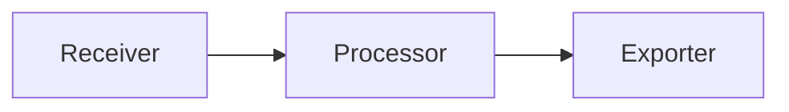

# How {} processes telemetry

 runs a configuration that defines a graph of components.
That graph determines exactly how telemetry moves through the system.

Telemetry doesn't "flow through " in a generic or automatic way.
It moves along explicit connections between components.
If two components aren't connected, no data passes between them.
If a processor isn't configured in the path, no processing occurs.

Understanding this execution model makes it much easier to reason about behavior, performance, and outcomes.

For detailed behavior of individual components, refer to the [component reference](../reference/components/).

## Component graph execution

An  configuration declares components.
Each component has a specific role, such as receiving telemetry, processing it, or exporting it.

When  starts, it:

1. Instantiates the configured components.
1. Connects them according to their declared relationships.
1. Begins passing telemetry along those connections.

The result is a directed graph.
Telemetry flows from upstream components to downstream components.
The configuration defines the direction and shape of that flow.

No global pipeline automatically handles all data.
Every path is explicit.

## Telemetry enters, moves, and exits

In most configurations, telemetry follows a pattern like this:

This is a simplified representation of a single path through the component graph.
 executes the entire graph, which can branch, merge, and contain multiple independent telemetry flows.

Within any given path:

- Receivers handle protocol decoding and normalization so  can represent telemetry internally.
  They don't perform semantic transformations such as filtering, sampling, or redaction unless explicitly documented for that receiver.
  Their role is limited to ingestion, decoding, and normalization.
- Processors operate on that telemetry while it's inside .
- Exporters send telemetry to external backends or systems.

These roles are logical, not magical.
A receiver doesn't modify data unless you configure it to do so.
An exporter doesn't filter data unless something upstream has filtered it.

If a configuration connects a receiver directly to an exporter, telemetry passes through without intermediate modification.

## Explicit configuration

 doesn't:

- Automatically discover telemetry pipelines.
- Automatically parse log content.
- Automatically filter metrics.
- Automatically sample traces.
- Automatically redact or rewrite data.

You must define every transformation, filter, or routing decision in the configuration.
This includes decisions such as dropping telemetry, rewriting labels, sampling traces, or routing data to different backends.

This explicit model is intentional.
It gives you precise control over how  handles telemetry and avoids hidden behavior.

## Multiple pipelines

A single  configuration can contain multiple independent flows.

For example:

- One pipeline collects metrics and sends them to a metrics backend.
- Another pipeline collects logs and sends them to a log backend.
- A third pipeline receives traces and forwards them elsewhere.

These pipelines can share components, or they can be completely separate.
Their behavior depends entirely on how you connect them.

There's no requirement that all signals pass through the same path.

## Think in terms of data flow

When reading or writing an  configuration, it helps to think in terms of data movement:

1. Where does telemetry enter?
1. Which components receive it?
1. Which components does it flow through next?
1. Where does it leave ?

Following those connections reveals exactly what  does at runtime.

## Next steps

- [The component graph](./component-graph/) - Learn about components as building blocks and how connections define data flow.
- [Telemetry pipelines](./pipelines/) - Understand how telemetry flows from ingestion through processing to export.
- [Where telemetry is modified](./modify-telemetry/) - Learn where modification occurs in processing stages.
- [Read configurations as data flow](./read-configurations/) - Interpret configurations using the graph model.
